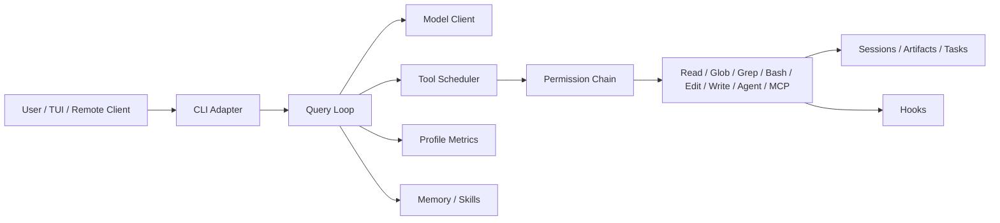

# Mini Claude Code

Safety-first learning implementation of a Claude Code-style coding agent.

## Status

The execution roadmap is implemented through Week 18. This project is a working v1 learning build, not a production Claude Code replacement.

## Run

```powershell
npm.cmd ci
npm.cmd run build
npm.cmd run myagent -- --help
npm.cmd run myagent -- week18 finalize
```

Use `ANTHROPIC_API_KEY` in the environment or local `.env` for real model calls. Offline tests use `FakeModel` and do not need an API key.

## Main Commands

- `myagent chat <prompt>`: single-turn text chat.
- `myagent agent <prompt>`: tool-using coding agent.
- `myagent tui`: interactive terminal session.
- `myagent memory <path|list|save>`: project memory.
- `myagent skill <list|show>`: local skill discovery.
- `myagent mcp <list|tools>`: MCP configuration and tool listing.
- `myagent task <start-bash|list|read|kill|notify>`: background task state machine.
- `myagent remote <serve|sessions>`: local WebSocket remote control.
- `myagent profile <startup|list|show>`: performance and cost profile reports.
- `myagent week18 finalize`: final offline smoke suite and portfolio report.

v1.1 improvement: `agent` reserves its final turn for a concise answer, so broad prompts can still finish with a useful summary instead of stopping cold at `max_turns`.

## Architecture



The query loop is the center: model output becomes `tool_use`, tools return `tool_result`, and the transcript drives the next turn.

## Safety Model

- Tools fail closed by default.
- `plan` mode allows only read-only tools.
- `default` mode requires approval for non-read-only tools when an approval channel exists.
- Headless `Edit` and `Write` require `bypassPermissions`.
- Bash is whitelist-only and rejects redirects, pipes, command chaining, subshells, absolute paths, parent traversal, and `.env` reads.
- `Edit` and `Write` use read-before-write state, diff preview, and staleness checks.

## What Is Intentionally Missing

- Cloud execution control plane.
- OAuth or credential injection service.
- Production OS/container sandbox.
- Full Claude Code UI and feature parity.
- Browser remote client UI.

The value of this v1 is clarity: a small, testable agent architecture that makes the main Claude Code design patterns concrete.
