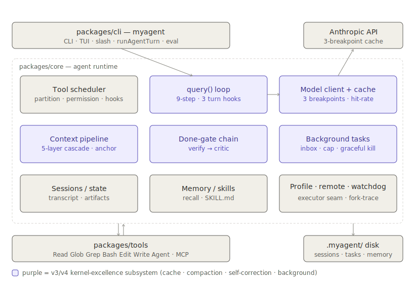
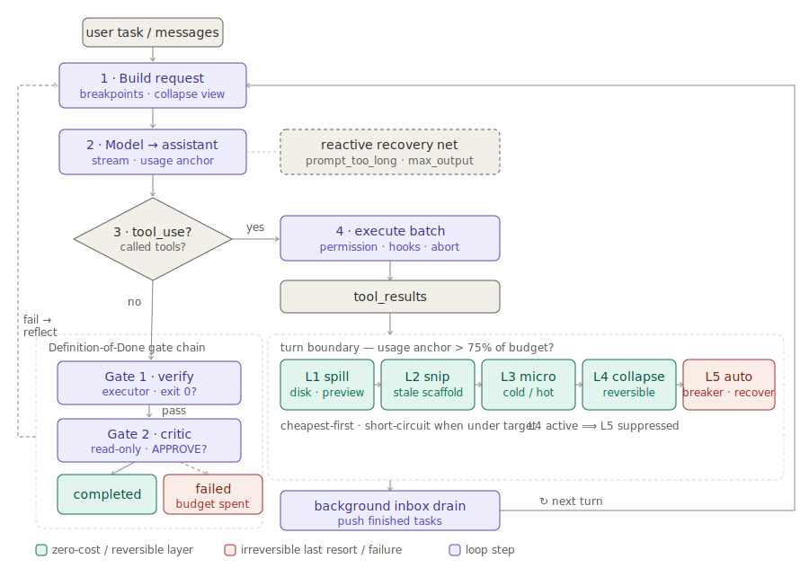

# Diagrams

Self-contained SVGs (inline styles, light/dark aware) of the system as of the v4
compaction-pipeline track. They render directly on GitHub and in browsers.

## System architecture (v4)

Static structure: the `cli` → `core` → `tools` layering plus on-disk state.
Purple boxes are the v3/v4 kernel-excellence subsystems — cache aligning, the
five-layer context pipeline, the done-gate chain, and the background state
machine.

## Per-turn query loop lifecycle (v4)

Dynamic flow of one turn: build request (a collapsed view when L4 is active) →
model → branch on `tool_use`. The tool branch runs the batch then the
turn-boundary **pre-flight compaction cascade** (usage-anchored trigger; five
layers L1 spill → L2 snip → L3 microcompact → L4 reversible collapse → L5 guarded
auto-compact, cheapest-first with short-circuit; `L4 active ⟹ L5 suppressed`)
plus the background inbox drain, then loops. The no-tool branch runs the
verify → critic done-gate chain, ending `completed` or `verification_failed`.

Colour legend: green = zero-cost / reversible layer, red = irreversible last
resort / failure, purple = loop step.

## Roadmaps

- `../v3-kernel-roadmap.md` — the four kernel-excellence capabilities (§1–§4).
- `../v4-compaction-pipeline-roadmap.md` — the five-layer compaction pipeline.
